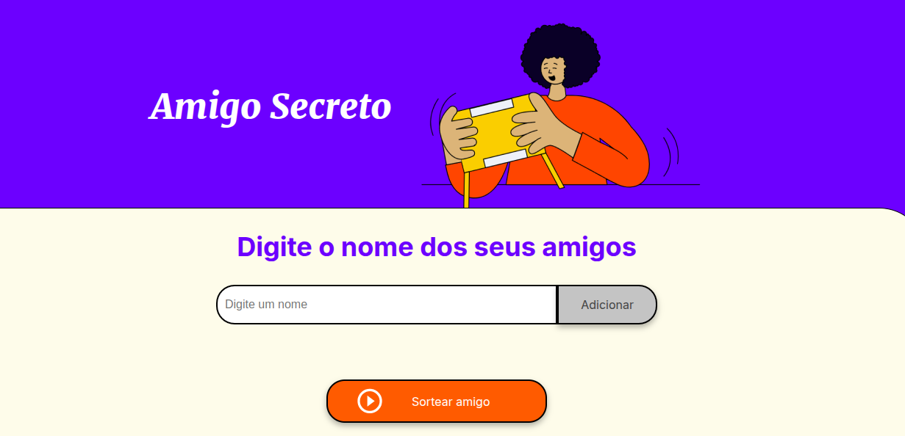

# DESAFIO AMIGO SECRETO

Projeto desenvolvido para o **Challenge de Iniciante em Programação**, do programa ONE, parceria de Alura + Oracle.

O Desafio Amigo Secreto é uma aplicação que permite fazer um sorteio de um amigo. Nela adicionamos os nomes dos nossos amigos e ao clicar no botão “sortear amigo” o sistema sorteia o amigo secreto!

## Índice
- <a href="#funcionalidades">Funcionalidades do projeto<a/>
- <a href="#layout">Layout<a/>
- <a href="#demonstração">Demonstração<a/>
- <a href="#rodar">Como rodar este projeto?<a/>
- <a href="#tecnologias">Tecnologias utilizadas<a/>
- <a href="#autoras">Pessoas autoras<a/>

## 📱Funcionalidades do projeto

-[x] Adicionar nome de amigos

-[x] Sortear amigo secreto

## Layout

## Demonstração
[video demonstração](assets/video_amigo_secreto.webm)

